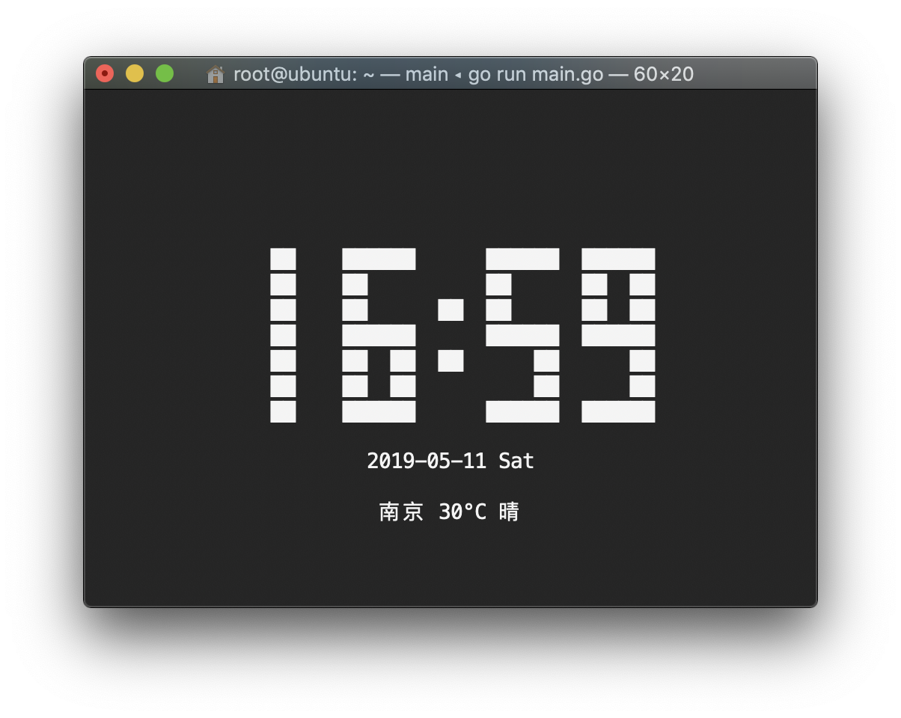

[](https://securityscorecards.dev/viewer/?uri=github.com/ahlfors/cmd-clock)

# cmd-clock
The digital clock in cmdline

Note: Weather service is only available in China.

[中文说明](README_CN.md)

## Install

```bash
$ go get github.com/lonord/cmd-clock
```

## Screenshot



## License

MIT
